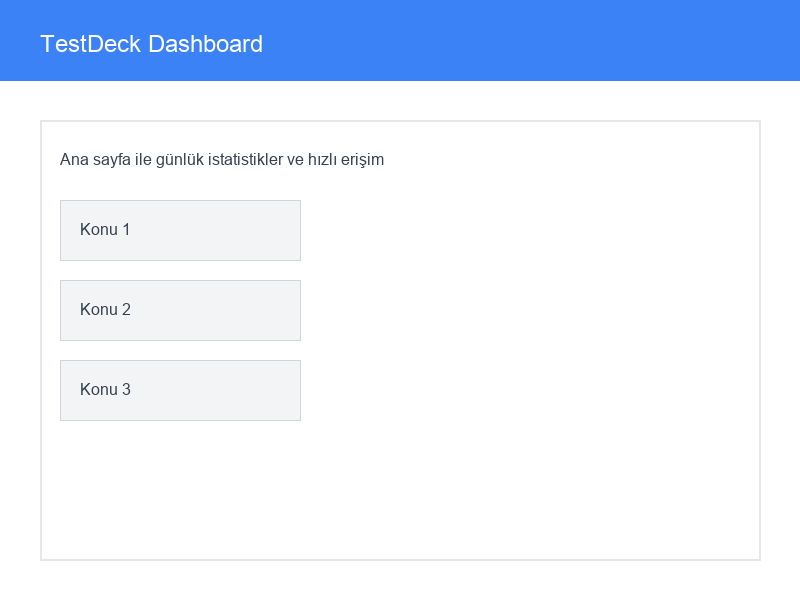
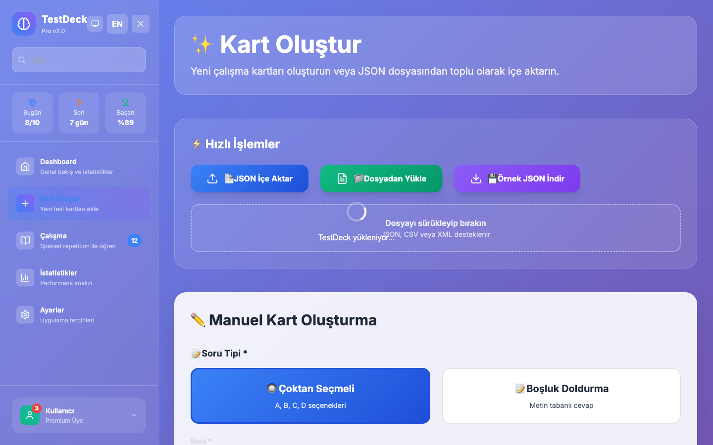
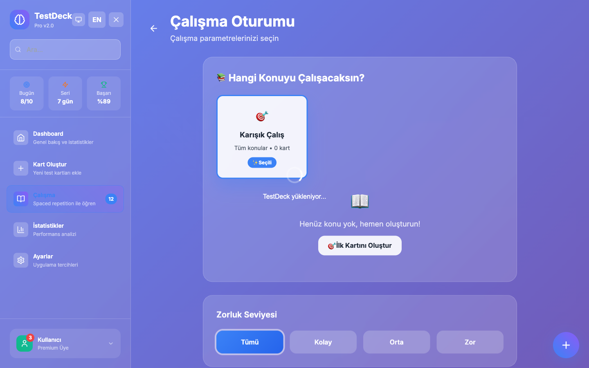

<div align="center">

# 🎓 TestDeck Local

Modern, offline flashcards & quiz app for focused learning

[](https://github.com/MertArtun/TestDeck/releases)
[](LICENSE)
[](#-quick-start)
[](https://github.com/MertArtun/TestDeck/actions)

_English • [Türkçe](README_TR.md)_

**[Screenshots](#-screenshots) · [Install](#-quick-start) · [Usage](#-usage) · [Tech Stack](#-tech-stack) · [Contributing](#-contributing)**

</div>

---

## 🌟 Highlights

<table>
<tr>
<td width="50%">

### 🧠 Smart Learning

- **SM-2 Algorithm** with personalized review intervals
- **Spaced Repetition** system for long-term memory
- **Adaptive difficulty** level adjustment
- **Performance tracking** and analytics

</td>
<td width="50%">

### 🔒 Privacy Focused

- **100% Offline** - no internet required
- **Local SQLite** database
- **Personal data** never sent anywhere
- **GDPR compliant** design

</td>
</tr>
<tr>
<td>

### 📝 Rich Content

- **5-choice** quiz questions (A-E)
- **Image support** (JPEG/PNG ≤5MB)
- **Unlimited subject** categories
- **Difficulty level** tagging

</td>
<td>

### 📊 Detailed Statistics

- **Daily performance** charts
- **Subject-based** success analysis
- **Time tracking** and study duration
- **Progress reports**

</td>
</tr>
</table>

## 🎯 Use Cases

- 🎓 **University Exams** - SAT, GRE, MCAT preparation
- 📜 **Certifications** - AWS, Microsoft, Google Cloud
- 🌍 **Language Learning** - Vocabulary, grammar, phrases
- 💼 **Professional Development** - Technical knowledge, interviews
- 🧮 **General Knowledge** - Math, science, history

## 📱 Screenshots

<div align="center">

### 🏠 Main Dashboard

_Daily statistics and quick access_



### ✏️ Card Creation

_Easy and intuitive card creation interface_



### 📚 Study Mode

_Focused learning experience_



</div>

## 🚀 Quick Start

<!-- Live Demo: Uncomment when Pages is stable -->
<!-- https://mertartun.github.io/TestDeck/ -->

### 📋 Requirements

- **Node.js** 18+ ([Download](https://nodejs.org/))
- **Rust** (latest stable) ([Download](https://rustup.rs/))
- **Git** ([Download](https://git-scm.com/))

### ⚡ Installation in 3 Steps

```bash
# 1. Clone the repository
git clone https://github.com/MertArtun/TestDeck.git
cd TestDeck

# 2. Install dependencies
npm install

# 3. Start the application
npm run tauri:dev
```

### 🏗️ Production Build

```bash
# Create desktop application
npm run tauri:build

# Create web version
npm run build
```

## 🛠️ Tech Stack

<div align="center">

| Category     | Technology            | Description                  |
| ------------ | --------------------- | ---------------------------- |
| **Frontend** | React 18 + TypeScript | Modern UI framework          |
| **Desktop**  | Tauri v1              | Rust-based desktop wrapper   |
| **Styling**  | Tailwind CSS          | Utility-first CSS framework  |
| **State**    | Zustand               | Lightweight state management |
| **Database** | SQLite                | Local database               |
| **Charts**   | Recharts              | Interactive charts           |
| **Icons**    | Lucide React          | Beautiful icons              |
| **Build**    | Vite                  | Fast build tool              |

</div>

## 📚 Usage

### 1️⃣ Getting Started

1. **Launch the application**
2. **Create your first card set**
3. **Start studying!**

### 2️⃣ Creating Cards

```markdown
📝 Question: How do you get the length of an array in JavaScript?

A) array.length()
B) array.size
C) array.length
D) array.count
E) array.length()

✅ Correct Answer: C
🏷️ Subject: JavaScript Fundamentals
⭐ Difficulty: Easy
```

### 3️⃣ Study Modes

| Mode                 | Description       | Usage                    |
| -------------------- | ----------------- | ------------------------ |
| **📖 Learning**      | Learn new cards   | First-time cards         |
| **🔄 Review**        | Spaced repetition | Previously studied cards |
| **⚡ Quick Test**    | Random questions  | General review           |
| **🎯 Subject-based** | Specific topics   | Focused study            |

### 4️⃣ SM-2 Algorithm

TestDeck uses the **SuperMemo-2 algorithm** to optimize card review timing:

- 🎯 **First correct**: Review in 1 day
- 🎯 **Second correct**: Review in 6 days
- 🎯 **Further correct**: Ease Factor × previous interval
- ❌ **Wrong answer**: Reset, review in 1 day

## 🗂️ Project Structure

```
testdeck-local/
├── 📱 src/
│   ├── 🧩 components/     # React components
│   ├── 📄 pages/          # Page components
│   ├── 🗃️ database/       # SQLite operations
│   ├── 📊 store/          # State management
│   ├── 🔧 utils/          # Helper functions
│   └── 📝 types/          # TypeScript types
├── 🦀 src-tauri/         # Rust backend
├── 📊 public/            # Static files
├── 📖 docs/              # Documentation
└── ⚙️ Config files
```

## 🔄 Roadmap

### v0.2.0 - _Advanced Features_ 🚧

- [ ] **🎵 Audio Support** - Voice recordings
- [ ] **🎥 Video Support** - Video content
- [ ] **☁️ Cloud Sync** - Optional cloud synchronization
- [ ] **🎨 Theme Editor** - Custom color themes
- [ ] **📤 Card Sharing** - Share card sets

### v0.3.0 - _Platform Expansion_ 🚀

- [ ] **📱 Mobile App** - React Native version
- [ ] **👥 Multi-user** - Family/team support
- [ ] **🤖 AI Support** - Automatic question generation
- [ ] **🔗 API** - Third-party integrations
- [ ] **🌐 Web App** - Full web version

### v1.0.0 - _Full Release_ 🎯

- [ ] **📚 Card Store** - Ready-made card sets
- [ ] **🏆 Gamification** - Badges and achievements
- [ ] **📊 Advanced Analytics** - ML-based analysis
- [ ] **🔔 Smart Notifications** - Learning reminders

## 🐛 Known Issues

| Issue                                 | Status      | Solution                     |
| ------------------------------------- | ----------- | ---------------------------- |
| Large images cause performance issues | ⚠️ Known    | Will be optimized in v0.2    |
| First launch database delay           | ℹ️ Normal   | ~2-3 second wait             |
| macOS Gatekeeper warning              | ℹ️ Expected | Allow in Settings > Security |

> 🔍 **To report issues**: Use the [Issues](https://github.com/MertArtun/TestDeck/issues) page

## 🤝 Contributing

We welcome contributions to TestDeck Local!

### 📝 Contribution Process

1. **🍴 Fork** the repository
2. **🌿 Create feature branch**
   ```bash
   git checkout -b feature/amazing-feature
   ```
3. **💾 Commit** your changes
   ```bash
   git commit -m 'feat: Add amazing feature'
   ```
4. **📤 Push** to the branch
   ```bash
   git push origin feature/amazing-feature
   ```
5. **🔄 Create Pull Request**

### 📋 Types of Contributions

- 🐛 **Bug fixes** - Error corrections
- ✨ **Features** - New functionality
- 📚 **Documentation** - Documentation improvements
- 🎨 **UI/UX** - Interface enhancements
- ⚡ **Performance** - Performance optimizations
- 🔒 **Security** - Security improvements

### 🏷️ Commit Conventions

```bash
feat: new feature
fix: bug fix
docs: documentation
style: code formatting
refactor: code restructuring
test: adding tests
chore: configuration changes
```

## 📄 License

This project is licensed under the **MIT License**. See the [LICENSE](LICENSE) file for details.

```
MIT License - Use, modify, distribute freely! 🚀
```

## 📞 Contact & Support

<div align="center">

### 💬 Community

[](https://github.com/MertArtun/TestDeck/issues)
[](https://github.com/MertArtun/TestDeck/discussions)

### 📧 Contact

- **🐛 Bug Reports**: [Issues](https://github.com/MertArtun/TestDeck/issues)
- **💡 Feature Requests**: [Discussions](https://github.com/MertArtun/TestDeck/discussions)
- **❓ Questions**: [Discussions Q&A](https://github.com/MertArtun/TestDeck/discussions/categories/q-a)

</div>

## 🙏 Acknowledgments

Thanks to the amazing technologies that make TestDeck Local possible:

- 🧠 **[SuperMemo](https://www.supermemo.com/)** - For the SM-2 algorithm
- 🦀 **[Tauri Team](https://tauri.app/)** - For the amazing framework
- ⚛️ **[React Team](https://reactjs.org/)** - For the UI library
- 🎨 **[Tailwind CSS](https://tailwindcss.com/)** - For styling
- 🔒 **[SQLite](https://sqlite.org/)** - For reliable database

---

<div align="center">

**TestDeck Local v0.1.0**

_Designed for your personal development_ 🎓

Made with ❤️ by [Mert Artun](https://github.com/MertArtun)

⭐ **If you like this project, don't forget to give it a star!**

</div>
