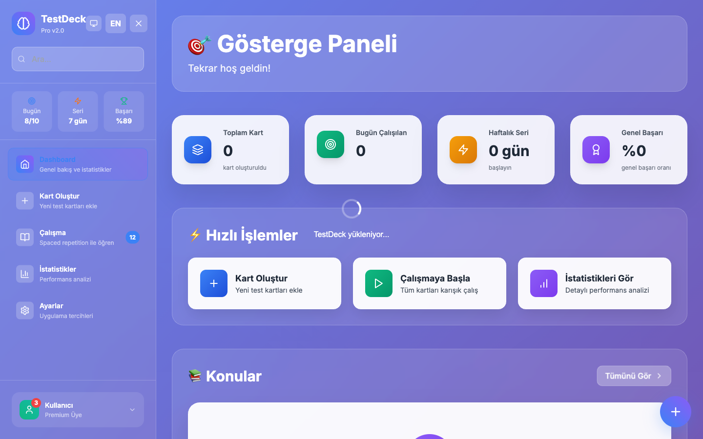
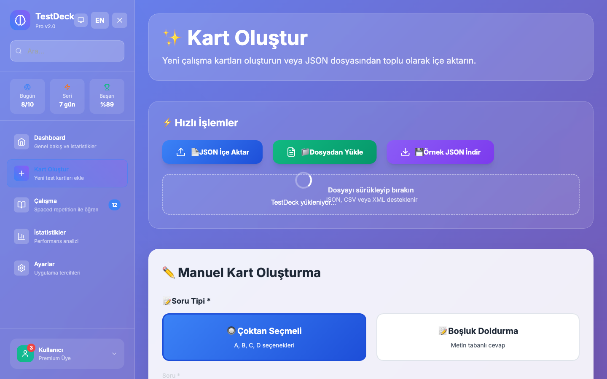
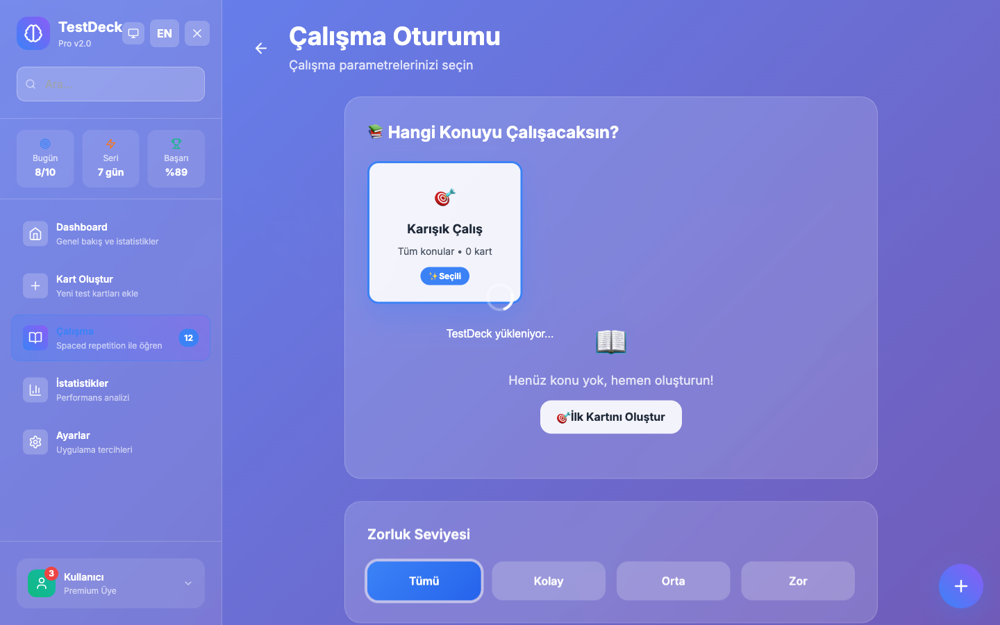

<div align="center">

# 🎓 TestDeck Local

**Modern, offline personal flashcard and quiz application**

_Effective learning experience with spaced repetition algorithm_

[](https://github.com/YOUR_USERNAME/testdeck-local/releases)
[](LICENSE)
[](#-installation)
[](https://tauri.app/)
[](https://reactjs.org/)

[📖 Demo](#-screenshots) • [🚀 Installation](#-quick-start) • [📚 Documentation](#-usage) • [🤝 Contributing](#-contributing)

</div>

---

## 🌟 Key Features

<table>
<tr>
<td width="50%">

### 🧠 Smart Learning

- **SM-2 Algorithm** with personalized review intervals
- **Spaced Repetition** system for long-term memory
- **Adaptive difficulty** level adjustment
- **Performance tracking** and analytics

</td>
<td width="50%">

### 🔒 Privacy Focused

- **100% Offline** - no internet required
- **Local SQLite** database
- **Personal data** never sent anywhere
- **GDPR compliant** design

</td>
</tr>
<tr>
<td>

### 📝 Rich Content

- **5-choice** quiz questions (A-E)
- **Image support** (JPEG/PNG ≤5MB)
- **Unlimited subject** categories
- **Difficulty level** tagging

</td>
<td>

### 📊 Detailed Statistics

- **Daily performance** charts
- **Subject-based** success analysis
- **Time tracking** and study duration
- **Progress reports**

</td>
</tr>
</table>

## 🎯 Use Cases

- 🎓 **University Exams** - SAT, GRE, MCAT preparation
- 📜 **Certifications** - AWS, Microsoft, Google Cloud
- 🌍 **Language Learning** - Vocabulary, grammar, phrases
- 💼 **Professional Development** - Technical knowledge, interviews
- 🧮 **General Knowledge** - Math, science, history

## � Ekran Görüntüleri

<div align="center">

### 🏠 Ana Dashboard

_Günlük istatistikler ve hızlı erişim_



### ✏️ Kart Oluşturma

_Kolay ve intuitive kart oluşturma arayüzü_



### 📚 Çalışma Modu

_Fokuslu çalışma deneyimi_



</div>

## � Hızlı Başlangıç

### 📋 Gereksinimler

- **Node.js** 18+ ([İndir](https://nodejs.org/))
- **Rust** (latest stable) ([İndir](https://rustup.rs/))
- **Git** ([İndir](https://git-scm.com/))

### ⚡ 3 Adımda Kurulum

```bash
# 1. Projeyi klonlayın
git clone https://github.com/YOUR_USERNAME/testdeck-local.git
cd testdeck-local

# 2. Bağımlılıkları yükleyin
npm install

# 3. Uygulamayı başlatın
npm run tauri:dev
```

### 🏗️ Production Build

```bash
# Desktop uygulaması oluştur
npm run tauri:build

# Web versiyonu oluştur
npm run build
```

## 🛠️ Teknoloji Stack

<div align="center">

| Kategori     | Teknoloji             | Açıklama                     |
| ------------ | --------------------- | ---------------------------- |
| **Frontend** | React 18 + TypeScript | Modern UI framework          |
| **Desktop**  | Tauri v1.8            | Rust-based desktop wrapper   |
| **Styling**  | Tailwind CSS          | Utility-first CSS framework  |
| **State**    | Zustand               | Lightweight state management |
| **Database** | SQLite                | Local database               |
| **Charts**   | Recharts              | Interactive charts           |
| **Icons**    | Lucide React          | Beautiful icons              |
| **Build**    | Vite                  | Fast build tool              |

</div>

## 📚 Kullanım

### 1️⃣ İlk Adımlar

1. **Uygulamayı başlatın**
2. **İlk kart setinizi** oluşturun
3. **Çalışmaya başlayın!**

### 2️⃣ Kart Oluşturma

```markdown
📝 Soru: JavaScript'te bir array'in uzunluğunu nasıl öğreniriz?

A) array.length()
B) array.size
C) array.length
D) array.count
E) array.length()

✅ Doğru Cevap: C
🏷️ Konu: JavaScript Temelleri
⭐ Zorluk: Kolay
```

### 3️⃣ Çalışma Modları

| Mod               | Açıklama              | Kullanım                    |
| ----------------- | --------------------- | --------------------------- |
| **📖 Öğrenme**    | Yeni kartları öğrenme | İlk kez görülen kartlar     |
| **🔄 Tekrar**     | Spaced repetition     | Daha önce çalışılan kartlar |
| **⚡ Hızlı Test** | Rastgele sorular      | Genel tekrar                |
| **🎯 Konu Bazlı** | Belirli konular       | Odaklanmış çalışma          |

### 4️⃣ SM-2 Algoritması

TestDeck, **SuperMemo-2 algoritması** kullanarak kartların tekrar zamanlarını optimize eder:

- 🎯 **İlk doğru**: 1 gün sonra
- 🎯 **İkinci doğru**: 6 gün sonra
- 🎯 **Sonraki doğrular**: Ease Factor × önceki aralık
- ❌ **Yanlış cevap**: Başa dön, 1 gün sonra

## 🗂️ Proje Yapısı

```
testdeck-local/
├── 📱 src/
│   ├── 🧩 components/     # React bileşenleri
│   ├── 📄 pages/          # Sayfa bileşenleri
│   ├── 🗃️ database/       # SQLite işlemleri
│   ├── 📊 store/          # State management
│   ├── 🔧 utils/          # Yardımcı fonksiyonlar
│   └── 📝 types/          # TypeScript tipleri
├── 🦀 src-tauri/         # Rust backend
├── 📊 public/            # Statik dosyalar
├── 📖 docs/              # Dokümantasyon
└── ⚙️ Config dosyaları
```

## 🔄 Roadmap

### v0.2.0 - _Gelişmiş Özellikler_ 🚧

- [ ] **🎵 Ses Desteği** - Ses kayıtları ekleme
- [ ] **🎥 Video Desteği** - Video içerik ekleme
- [ ] **☁️ Cloud Sync** - İsteğe bağlı bulut senkronizasyonu
- [ ] **🎨 Tema Düzenleyici** - Özel renk temaları
- [ ] **📤 Kart Paylaşımı** - Kart setlerini paylaşma

### v0.3.0 - _Platform Genişletme_ 🚀

- [ ] **📱 Mobil App** - React Native versiyonu
- [ ] **👥 Çoklu Kullanıcı** - Aile/takım desteği
- [ ] **🤖 AI Desteği** - Otomatik soru oluşturma
- [ ] **🔗 API** - Üçüncü parti entegrasyonlar
- [ ] **🌐 Web App** - Tam web versiyonu

### v1.0.0 - _Tam Sürüm_ 🎯

- [ ] **📚 Kart Mağazası** - Hazır kart setleri
- [ ] **🏆 Gamification** - Rozet ve başarımlar
- [ ] **📊 Gelişmiş Analitik** - ML tabanlı analizler
- [ ] **🔔 Akıllı Bildirimler** - Öğrenme hatırlatıcıları

## 🐛 Bilinen Sorunlar

| Sorun                             | Durum       | Çözüm                       |
| --------------------------------- | ----------- | --------------------------- |
| Büyük görseller performans sorunu | ⚠️ Bilinen  | v0.2'de optimize edilecek   |
| İlk açılış veritabanı gecikmesi   | ℹ️ Normal   | ~2-3 saniye bekleme         |
| macOS Gatekeeper uyarısı          | ℹ️ Beklenen | Ayarlar > Güvenlik'ten izin |

> 🔍 **Sorun bildirmek için**: [Issues](https://github.com/YOUR_USERNAME/testdeck-local/issues) sayfasını kullanın

## 🤝 Katkıda Bulunma

TestDeck Local'a katkıda bulunmak isterseniz:

### 📝 Katkı Süreci

1. **🍴 Fork** edin
2. **🌿 Feature branch** oluşturun
   ```bash
   git checkout -b feature/amazing-feature
   ```
3. **💾 Commit** edin
   ```bash
   git commit -m 'feat: Add amazing feature'
   ```
4. **📤 Push** edin
   ```bash
   git push origin feature/amazing-feature
   ```
5. **🔄 Pull Request** oluşturun

### 📋 Katkı Türleri

- 🐛 **Bug fixes** - Hata düzeltmeleri
- ✨ **Features** - Yeni özellikler
- 📚 **Documentation** - Dokümantasyon iyileştirmeleri
- 🎨 **UI/UX** - Arayüz geliştirmeleri
- ⚡ **Performance** - Performans optimizasyonları
- 🔒 **Security** - Güvenlik iyileştirmeleri

### 🏷️ Commit Konvansiyonları

```bash
feat: yeni özellik
fix: hata düzeltmesi
docs: dokümantasyon
style: kod formatı
refactor: kod yeniden düzenleme
test: test ekleme
chore: yapılandırma değişiklikleri
```

## 📄 Lisans

Bu proje **MIT Lisansı** altında lisanslanmıştır. Detaylar için [LICENSE](LICENSE) dosyasına bakın.

```
MIT License - Özgürce kullanın, değiştirin, dağıtın! 🚀
```

## 📞 İletişim & Destek

<div align="center">

### 💬 Topluluk

[](https://github.com/YOUR_USERNAME/testdeck-local/issues)
[](https://github.com/YOUR_USERNAME/testdeck-local/discussions)

### 📧 İletişim

- **🐛 Bug Reports**: [Issues](https://github.com/YOUR_USERNAME/testdeck-local/issues)
- **💡 Feature Requests**: [Discussions](https://github.com/YOUR_USERNAME/testdeck-local/discussions)
- **❓ Sorular**: [Discussions Q&A](https://github.com/YOUR_USERNAME/testdeck-local/discussions/categories/q-a)

</div>

## 🙏 Teşekkürler

TestDeck Local'ı mümkün kılan harika teknolojilere teşekkürler:

- 🧠 **[SuperMemo](https://www.supermemo.com/)** - SM-2 algoritması için
- 🦀 **[Tauri Team](https://tauri.app/)** - Müthiş framework için
- ⚛️ **[React Team](https://reactjs.org/)** - UI library için
- 🎨 **[Tailwind CSS](https://tailwindcss.com/)** - Styling için
- 🔒 **[SQLite](https://sqlite.org/)** - Güvenilir veritabanı için

---

<div align="center">

**TestDeck Local v0.1.0**

_Kişisel gelişiminiz için tasarlandı_ 🎓

Made with ❤️ by [Your Name](https://github.com/YOUR_USERNAME)

⭐ **Bu projeyi beğendiyseniz yıldız vermeyi unutmayın!**

</div>
